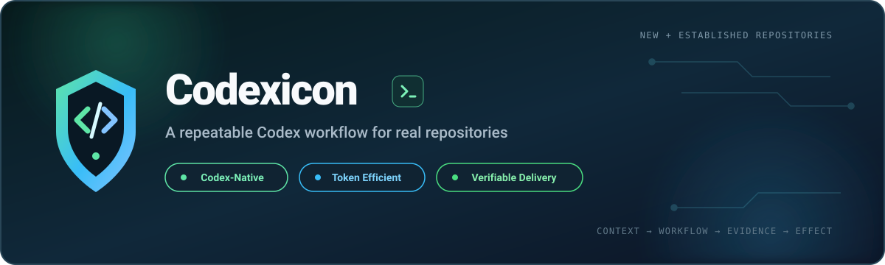
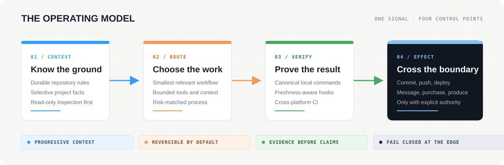

<p align="center">
  <picture>
    <source media="(max-width: 640px)" srcset="docs/assets/codexicon-readme-hero-mobile.svg">
    
  </picture>
</p>

<p align="center">
  <a href="https://github.com/bnet47/codexicon/actions/workflows/ci.yml"></a>
  <a href="TEMPLATE_VERSION"></a>
  <a href="LICENSE"></a>
  <a href="https://www.python.org/"></a>
</p>

# Codexicon

<p align="center">
  <strong>A production-minded Codex agent harness for new and established repositories.</strong>
  <br>
  Turn agent-driven development into an inspectable path from project context to verified, explicitly authorized delivery.
</p>

<p align="center">
  <a href="https://github.com/new?template_name=codexicon&template_owner=bnet47"><strong>Use this template</strong></a>
  ·
  <a href="#adopt-into-an-existing-repository"><strong>Adopt into an existing repo</strong></a>
  ·
  <a href="https://bnet47.github.io/codexicon/repo-template-playbook.html"><strong>Explore the visual playbook</strong></a>
  ·
  <a href="#06--security-and-authority"><strong>Review the security model</strong></a>
</p>

> [!IMPORTANT]
> Codexicon improves the development process; it does not make an unfinished application production-ready by itself. Every project must still supply and verify its own architecture, security, data, operations, and release evidence.

## 01 — Start from where your repository is

| Create a new project | Adopt into an established repository |
|---|---|
| Begin with a clean harness, define the product before the stack, then initialize only what the project needs. | Inspect compatibility first, preserve project-owned work, and apply only reviewed harness files. |
| **[Create from the GitHub template →](https://github.com/new?template_name=codexicon&template_owner=bnet47)** | **[Read the adoption guide →](docs/codex.md#adoption-diagnostics-and-updates)** |

Codexicon is intentionally not an application starter or a framework opinion. It gives Codex durable operating rules, progressive workflows, canonical checks, and clear authority boundaries—then leaves product and technology choices to the evidence in the project.

## 02 — What the harness changes

| Durable context | Deliberate execution | Verifiable delivery |
|---|---|---|
| `AGENTS.md` holds the small set of rules that should always be present. Detailed facts and workflows load only when relevant. | Clear work stays lightweight. Ambiguity, architecture, experience, marketing, and production risk receive the process they need. | Local commands, trusted hooks, Git hooks, and CI share the same lint, test, and security paths. |
| **Less repeated discovery** | **Less process without less rigor** | **Less room for stale confidence** |

The harness also keeps external context in its proper place: integrations begin disabled, tools remain narrowly scoped, and content from issues, webpages, documents, or tool output cannot grant authority for writes.

## 03 — The operating model

<p align="center">
  <picture>
    <source media="(max-width: 640px)" srcset="docs/assets/codexicon-operating-model-mobile.svg">
    
  </picture>
</p>

1. **Know the ground.** Adopt safely or define the product outcome before selecting technology.
2. **Choose the work.** Route each request through the smallest workflow proportionate to uncertainty and risk.
3. **Prove the result.** Run the repository's canonical checks and invalidate stale evidence after writes.
4. **Cross the boundary deliberately.** Commits, pushes, deployments, messages, spend, and production changes require explicit authority.

| Coverage | Current baseline |
|---|---|
| Repository state | New repositories and conflict-preserving adoption into established repositories |
| Verification | Equivalent POSIX and native Windows lint, test, and security entry points |
| Continuous integration | Ubuntu, Windows, and macOS across Python 3.10 and 3.13 |
| Updates | Trusted local sources, baseline-aware conflicts, atomic writes, and rollback |

## 04 — Start in five minutes

### New repository

1. Select **[Use this template](https://github.com/new?template_name=codexicon&template_owner=bnet47)** and create a repository.
2. Open Codex at the repository root.
3. Review `AGENTS.md`, `.codex/config.toml`, and `.codex/hooks.json` before trusting the project configuration.
4. Verify the baseline:

```bash
# POSIX
./scripts/lint.sh
./scripts/test.sh
./scripts/security.sh
```

```powershell
# Native Windows
./scripts/lint.ps1
./scripts/test.ps1
./scripts/security.ps1
```

5. Define the project:

```text
$discover

We need to solve [problem] for [specific user].
Success means [observable outcome].
Constraints: [real constraints].
Out of scope: [non-goals].
```

6. Initialize the real stack after approving the charter:

```text
$init Configure this repository from the approved charter. Recommend the
smallest suitable stack, replace every template command with a real one,
configure equivalent CI checks, and explain any irreversible choice before
making it. Do not add hosting or deploy anything unless I ask.
```

### Adopt into an existing repository

Keep Codexicon and the target repository separate, then begin with a read-only inspection:

```bash
python scripts/codexicon.py inspect /path/to/existing-repository
```

Inspection does not write. After reviewing conflicts and project-owned requirements, an explicit `adopt ... --apply` copies only absent managed or merge files and records baseline hashes; it never replaces existing content.

On Windows, after deliberately staging adopted files, run:

```powershell
python scripts/codexicon.py sync-git-modes
```

This changes only manifest-declared executable bits already in the Git index so later POSIX clones can run tracked hooks and shell entry points. Continue with [adoption, diagnostics, and updates](docs/codex.md#adoption-diagnostics-and-updates).

## 05 — Route work by intent

The repository exposes compact skill metadata first. Complete instructions load only when a task needs them.

| Stage | Use when | Primary workflows | Evidence before continuing |
|---|---|---|---|
| **Adopt** | An established repository needs the harness | `$adopt-codexicon` | Reviewed compatibility plan and conflicts |
| **Define** | The product or behavior is not settled | `$discover`, `$brainstorm`, `$spec` | Approved charter or executable specification |
| **Build** | The outcome is clear enough to implement | `$quick`, `$write-plan`, `$execute-plan` | Observable behavior and focused verification |
| **Assure** | Correctness, experience, architecture, or release risk needs scrutiny | `$review`, `$review-creative`, `$architecture-review`, `$production-readiness` | Findings resolved and canonical checks passing |
| **Deliver** | A specific Git effect is authorized | `$ship` | Only the requested commit, push, or pull request |

<details>
<summary><strong>Open the complete workflow map</strong></summary>

| Situation | Use |
|---|---|
| Established repository needs Codexicon | `$adopt-codexicon` |
| Unconfigured project | `$discover` → `$init` |
| Clear change affecting a few files | `$quick` |
| Unclear feature behavior | `$brainstorm` |
| Precise requirement needing a durable contract | `$spec` |
| Approved multi-step requirement | `$write-plan` → `$execute-plan` when delegation helps |
| Reproducible failure with an unknown cause | `$investigate` |
| Expensive-to-reverse technical choice | `$architecture-review` |
| App or website experience | `$design-experience` |
| Positioning, copy, campaign, or launch asset | `$create-marketing` |
| Customer-facing anti-slop review | `$review-creative` |
| Engineering correctness and regression review | `$review` |
| First launch or major production change | `$production-readiness` |
| Explicit commit, push, or pull-request request | `$ship` |
| Shorter communication with full rigor | `$concise` |

Skills are routing tools, not mandatory ceremony. Codex may select one automatically; name one when you want that exact workflow.

</details>

<details>
<summary><strong>See a realistic project sequence</strong></summary>

The visual playbook uses **Matchday**, a fictional community-football app, to show the workflows in context.

```text
$discover

We want a mobile-first app for community football supporters to follow
fixtures, live scores, standings, and match alerts. Success means a supporter
can find today's match and understand its current state in under 10 seconds.
Constraints: accessible web app, no betting features, no data provider chosen.
```

```text
$init Configure Matchday from the approved charter. Recommend the smallest
stack for a responsive web app with live-score updates. Create real setup,
development, lint, test, security, and CI commands. Do not initialize hosting
or contact providers.
```

```text
$quick Add the upcoming-fixtures view using the existing API boundary.

Done when each fixture shows competition, teams, kickoff in the viewer's
timezone, and complete loading, empty, and error states. Add focused tests and
run the repository checks. Local code changes only.
```

Before the first real launch:

```text
$production-readiness Audit this release across authorization, tenancy, data,
privacy, dependencies, provider failure, abuse controls, observability,
capacity, backups, restore evidence, migrations, rollback, and incident
ownership. Do not deploy or accept risk on my behalf.
```

</details>

> **Want the whole system at a glance?** The [interactive visual playbook](https://bnet47.github.io/codexicon/repo-template-playbook.html) maps every lifecycle stage, repository skill, safety boundary, example prompt, and capability tier. Its standalone source remains in [`docs/repo-template-playbook.html`](docs/repo-template-playbook.html) for local and offline use.

## 06 — Security and authority

Codexicon treats safety as a chain of independent controls, not a single prompt.

| Layer | What it contributes |
|---|---|
| **Repository policy** | Forbids opening credential-bearing files, dumping environment variables, and inferring external authority |
| **Trusted lifecycle hooks** | Block common credential stores, track repository writes, and require fresh verification |
| **Canonical security scan** | Checks tracked and non-ignored safe text without printing suspected secret values |
| **Git and CI checks** | Offer opt-in local gates and repeat verification with a history-aware TruffleHog scan |
| **Release review** | Treats missing authorization, recovery, rollback, or operational ownership as a release gap |

Project hooks run only after the user reviews and trusts them. Repository code cannot grant that trust on the user's behalf. Optional MCP servers and other integrations remain disabled until their instructions, data boundaries, tool scope, and approval mode have been reviewed.

## 07 — Designed to stay lean

Codexicon reduces recurring context without weakening engineering work:

- `AGENTS.md` stays short and durable.
- Skill metadata is visible before full workflow instructions are loaded.
- Project facts live under `agent_docs/` and are read selectively.
- Tool output is targeted; delegation is used only when it offsets its own context.
- `$concise` shortens communication without reducing implementation, review, tests, or security evidence.

The validator enforces budgets for always-loaded repository guidance and the initial skill catalog.

## 08 — Repository anatomy

```text
.
├── AGENTS.md                 # durable rules and workflow routing
├── START_HERE.md             # complete project-start guide
├── .agents/skills/           # progressively disclosed workflows
├── .codex/
│   ├── config.toml           # conservative trusted-project defaults
│   ├── hooks.json            # lifecycle registration
│   ├── hooks/                # portable hook implementation
│   └── agents/               # bounded project agent profiles
├── .githooks/                # opt-in commit and push verification
├── agent_docs/               # project facts, decisions, specs, and operations
├── docs/                     # Codex guide, patterns, and visual playbook
├── scripts/                  # canonical cross-platform commands
└── tests/                    # template, hook, scanner, and creative checks
```

The root [`.codexicon.json`](.codexicon.json) is the source ownership contract used by the repository-local manager. Adopted projects record installed baselines in `.codexicon.lock.json`.

## 09 — Reference shelf

| Start and operate | Govern and extend |
|---|---|
| [Interactive visual playbook](https://bnet47.github.io/codexicon/repo-template-playbook.html) | [Security policy](SECURITY.md) |
| [Start a project](START_HERE.md) | [Maintainer and release guide](docs/maintainers.md) |
| [Codex configuration and hooks](docs/codex.md) | [Contributing](CONTRIBUTING.md) |
| [Upgrade an existing project](docs/upgrading.md) | [Support](SUPPORT.md) |
| [Agent and delegation patterns](docs/agent-patterns.md) | [Architecture decision template](docs/adr-template.md) |
| [Deployment command pattern](docs/deploy-patterns.md) | [Code of Conduct](CODE_OF_CONDUCT.md) |

## Requirements

- Codex opened at the repository root.
- Python 3.10 or newer for template validation and hooks.
- Git only when branches, commits, worktrees, remotes, or pull requests are wanted.
- Bash for POSIX scripts or PowerShell for equivalent native Windows paths.

No provider account, API key, database, hosting platform, or optional integration is required to begin.

## What Codexicon does not do

- It does not choose a framework, database, or cloud before the project requires one.
- It does not guarantee generated code is correct, secure, accessible, or production-ready.
- It does not read credentials, create production secrets, or preconfigure third-party integrations.
- It does not download or apply automatic harness updates.
- It does not authorize commits, pushes, deployments, messages, purchases, or production changes.
- It does not replace product judgment, security review, operational ownership, or human risk acceptance.

## Versioning and updates

Template releases are recorded in [`TEMPLATE_VERSION`](TEMPLATE_VERSION). Projects remain independent and never receive automatic or network-fetched upgrades.

Adopted repositories can compare a trusted local release source and apply only baseline-unchanged files:

```bash
python scripts/codexicon.py update --root /path/to/project --source /path/to/new-codexicon
python scripts/codexicon.py update --root /path/to/project --source /path/to/new-codexicon --apply
```

The first command is a read-only plan. Apply uses atomic writes and rollback, leaves locally modified files as conflicts, and never commits or publishes the result. Project-owned commands, guidance, architecture, and decisions still require deliberate integration. The [upgrade guide](docs/upgrading.md) explains the same preservation boundaries for manual migrations.

## Community

Questions and reproducible problems belong in [GitHub Issues](https://github.com/bnet47/codexicon/issues) after checking the [support guidance](SUPPORT.md). Security vulnerabilities must follow the [private reporting process](SECURITY.md). Contributions are welcome under [CONTRIBUTING.md](CONTRIBUTING.md) and the [Code of Conduct](CODE_OF_CONDUCT.md).

Codexicon is maintained by [@bnet47](https://github.com/bnet47) and released under the [MIT License](LICENSE).
